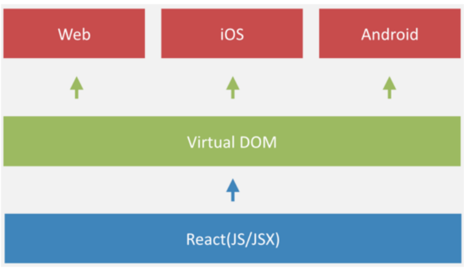

# 一、起源

React来源于Facebook内部项目，用来架设Instagram网站（ins），并于2013年5月开源。

React Native（简称RN）是React在移动端（Android，iOS）的项目。

它的口号是：Learn once，write anywhere!



# 二、开发环境搭建

### 需安装的模块：

> Node.js（10.16.3）`https://nodejs.org/en/`

> JDK（1.8）`https://www.oracle.com/cn/java/technologies/downloads/`

> Gradle（3.3）`https://gradle.org/releases/`

> Android Studio（2021.3.1.17）`https://developer.android.google.cn/studio`

### 需要注意的地方：

> node.js是js的运行环境，里面包含了npm的版本和node module的版本


> 安装完node.js后，设定npm的镜像仓库（淘宝源），用来加速包的下载。 

```shell
# 切换淘宝源
npx nrm use taobao
# 如需切回来官方源
npx nrm use npm
```

> 配置npm不做SSL检查

```shell
npm config set strict-ssl false
```

> 安装yarn。安装后，就可以用yarn代替npm install

```shell
npm install -g yarn
```

> 安装node.js后，查看node版本和npm版本：

```shell
# 查看node版本
node -v
# 查看npm
npm -v
```

> 安装JDK后（尽量不要改安装位置），查看安装的版本：

```shell
javac -version
```

配置系统变量：

1. 添加系统变量`JAVA_HOME`，并指向JDK的安装目录；

2. 修改Path系统变量，添加以下：

```shell
%JAVA_HOME%\bin
%JAVA_HOME%\jre\bin
```

3. 添加系统变量`CLASSPATH`，并使用以下值：

```shell
.\;%JAVA_HOME%\lib\dt.jar;\%JAVA_HOME%\lib\tools.jar;%JAVA_HOME%\bin;
```

> 配置gradle系统环境变量后，查看其版本：

```shell
gradle -v
```

如何配置系统变量？

1. 添加系统变量`GRADLE_HOME`，并指向gradle解压缩的目录；

2. 在Path系统变量中添加`%GRADLE_HOME%\bin`

> 配置Android环境

安装完Andriod Studio后，还需安装Android SDK和设定系统变量。

如何配置系统变量？

1. 添加系统环境变量`ANDROID_SDK_ROOT`，并指向实际安装的Android SDK地址

2. 把一些工具目录添加到Path系统变量中：
   
   ```shell
   %ANDROID_SDK_ROOT%\platform-tools  
   %ANDROID_SDK_ROOT%\emulator  
   %ANDROID_SDK_ROOT%\tools  
   %ANDROID_SDK_ROOT%\tools\bin
   ```


> 安装react native命令行工具

```shell
# 安装命令
npm install -g react-native-cli
# 卸载命令
npm uninstall -g react-native-cli
```

> 运行已有RN项目

```shell
react-native run-android
# 或者
yarn android
```

### 常见名词与问题：

> 什么是npm？

全称：**Node Package Manager**，即node包管理器（node.js官方提供）

> 什么是yarn？

yarn是facebook提供的用来**替代npm的工具**，可以加速node模块的下载

> 什么是gradle？

它是一款开源的自动化构建工具，是用来帮助我们**构建app的**。构建包括编译、打包等过程

> 什么是adb？

全名是**Android调试桥**（Android Debug Bridge），它充当调试桥。Adb是Android SDK中的工具，使用此工具，可以直接操作和管理Android模拟器或真实的Android设备。

# 三、组件的生命周期

在react中，所有UI的组件都被放置在<mark>render()</mark>中，并且被<mark>state</mark>状态控制。

render()方法定义了UI在各种状态下是如何展现的，当调用setState()方法时，react会找到需要改变的部分并替你修改。

生命周期定义：**组件从开始创建到最后销毁的过程**。

react组件大致分为3个阶段：

1. 组件的加载和初始化。


2. 组件的运行阶段。


3. 组件的销毁阶段。


